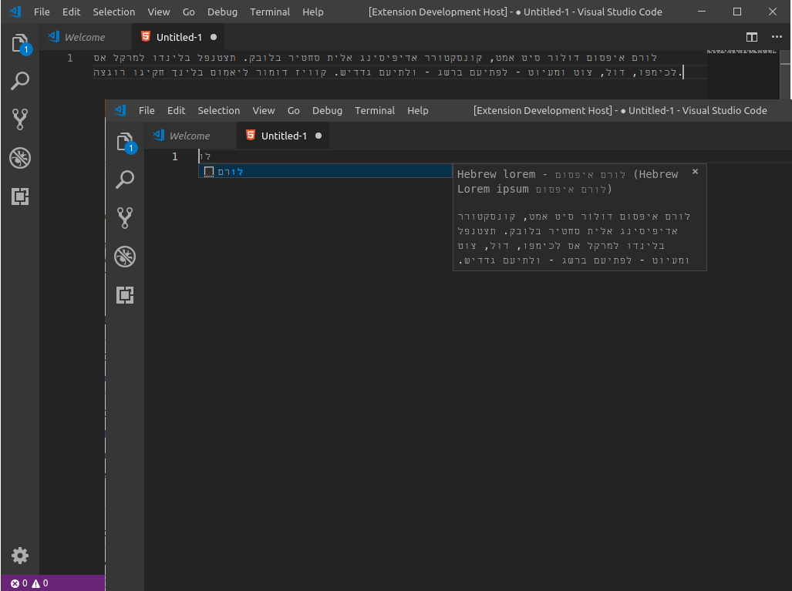

## Hebrew LOREM extension for Visual Studio Code

## Description
>This vesion og hebrew Lorem (extension for Visual Studio Code) is used to produce lorem ipsum in hebrew

>גירסה זו של הרחבה מייצרת טקסט לורם איפסום בעברית לטובת מפתחים שזקוקים לייצר טקסט כתבנית לעמוד

## Use

> \> hlorem

param     | nº words generated
--------- | --- 
*hlorem*  | 30 
*לורם*  | 30 
*hlorem10* | 10 
*hlorem12* | 20 
*hlorem50* | 50 
*hlorem90* | 90 
*hlorem120* | 120 
*hlorem170* | 170 
